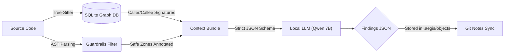

# Aegis: Local AI Code Review Engine

[](https://github.com/shameel0505/aegis/actions)
[](https://github.com/shameel0505/aegis)
[](https://opensource.org/licenses/MIT)

Aegis is an experimental, Git-native semantic code review and architectural analysis engine. It runs entirely on your local machine, leveraging small (3B-9B) quantization models and CodeGraph knowledge graphs to prevent cloud data leaks.

## The Problem Space: Framework Blindness
Most generic AI code reviewers suffer from **Framework Blindness** and **Context Starvation**. For example, they frequently flag false positives by complaining that a FastAPI `Depends()` returns `None`, simply because they lack the context of the framework's dependency injection lifecycle.

Aegis is an ongoing open-source experiment to solve this using a **Single-Pass Context Architecture**:

1. **Tree-Sitter Graph:** We parse the codebase into a SQLite graph DB to extract exact caller/callee signatures.
2. **AST Guardrails:** We deterministically analyze the Abstract Syntax Tree (AST) to tag framework-managed safe zones (like Dependency Injection paths or mapped exceptions).
3. **Context Bundling:** We bundle the cross-file edges and the AST guardrails directly into the prompt. This eliminates false-positives caused by framework blindness before the LLM even sees the code.



## Example Output

When Aegis correctly intercepts a genuine vulnerability (e.g., when JWT signature verification is intentionally disabled), it yields a structured JSON finding that can be synced across a team:

```json
{
  "finding": {
    "severity": "WARNING",
    "category": "SECURITY",
    "description": "The `verify_signature` option is set to `False`, which disables JWT signature verification. This can lead to security vulnerabilities as it allows for the creation and manipulation of tokens without proper authentication.",
    "faulty_snippet": "jwt.decode(token, secret_key, algorithms=[ALGORITHM], options={\"verify_signature\": False})",
    "evidence_graph": [
      {
        "type": "CALLER",
        "to": "tests/test_services/test_jwt.py::test_error_when_wrong_token_shape"
      }
    ]
  }
}
```

## Call for Contributors
We are actively looking for engineers to help build out Aegis. If you have experience with **Tree-sitter**, **AST parsing**, or **Local LLM orchestration**, we would love your help! 

Specifically, we need assistance with:
- Expanding the AST guardrails natively into JS, TS, and Go (currently only implemented in Python).
- Optimizing the SQLite context bundle queries.
- Enhancing the `.aegis/objects` cache invalidation logic.

Feel free to open an issue or submit a Pull Request!

## Quick Start

You can run the engine using the compiled executable or via standard Python `pip` installation:

### Installation
**Method 1: Pip Install (Cross-Platform)**
```bash
pip install aegis-core
```

**Method 2: Standalone Executable (Windows/Mac/Linux)**
Download the binary for your OS from the [Releases](https://github.com/shameel0505/aegis/releases) page.

*(Note: For the rest of the documentation, we'll use the `aegis` command assuming it's in your PATH via pip or the executable)*

### 1. Initialize the Storage
Just like `git init`, you need to initialize the aegis storage in your repo.
```bash
aegis init
```
This creates the `.aegis/` directory to store content-addressed finding objects.

### 2. Review a File or Symbol
Force the AI to perform a targeted review of a specific function, file, or full directory.
```bash
aegis review --file src/payment/stripe.py
aegis review .  # Sweeps entire repository
```

### 3. Invalidate Cache (2-Hop Decay)
When you modify a symbol, you can trigger a cache invalidation. The engine will mark the symbol and up to 2-hops of its dependents as stale, ensuring the AI re-reviews impacted code without locking up your machine.
```bash
aegis invalidate --file src/payment/stripe.py --symbol processPayment
```

### 4. Semantic Merge-Check
Before you merge a PR, run a semantic merge-check. This uses Git to calculate the blast radius of both branches and asks the model to evaluate any overlapping dependencies for logical conflicts.
```bash
aegis merge-check --branch-a feature/payment --branch-b feature/tax
```

### 5. Team Sync (Git Notes)
Sync your local AI findings with your team using Git's native infrastructure (requires at least one commit in your repo).
```bash
aegis push   # Pushes your local AI findings to origin
aegis fetch  # Pulls your team's findings
```

## Local Development & Compilation

Aegis is intentionally built using Python Standard Library modules to minimize dependency bloat.

To compile the `aegis.exe` standalone binary for yourself:
1. Ensure `pyinstaller` is installed (`pip install pyinstaller`).
2. Run the provided build script:
```powershell
.\build.ps1
```

## Environment Configuration
- `ENGINEER_LLM_URL`: The URL to your local OpenAI-compatible inference server (defaults to `http://127.0.0.1:8080/v1`). Set this to point to your local Ollama or llama.cpp instance.
